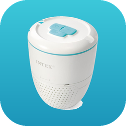

# Intex Pool — Home Assistant integration

Monitor an **Intex Water Analyzer (WA510 / #28607)** in Home Assistant: pH, ORP,
free chlorine, water temperature and battery — pulled from the Intex Link (Tuya) cloud.
Includes a custom Lovelace card.

> The Intex Link app is a Tuya ("ThingClips") OEM app. This integration talks to the same
> cloud API the app uses. It embeds the app's published client constants so it works with
> just your account login. Not affiliated with or endorsed by Intex or Tuya. Use at your own risk.



## Features
- 5 sensors (pH, ORP mV, free chlorine ppm, temperature, battery %) under one device, with
  automatic History + long-term Statistics graphs.
- UI config flow (email / password / country) — no YAML.
- Configurable poll interval (the analyzer samples roughly hourly).
- A bundled **Intex Pool Card** (gauges + safe-range colouring + water verdict), auto-registered.
- Pure-Python, async, **no extra Python dependencies** (uses HA's bundled `aiohttp` + `cryptography`).

## Install (HACS)
1. HACS → ⋮ → **Custom repositories** → add `https://github.com/bpietroiu/homeassistant-intex-pool`, category **Integration**.
2. Install "Intex Pool", then restart Home Assistant.
3. **Settings → Devices & Services → Add Integration → Intex Pool**.
4. Enter your Intex Link **email**, **password**, and **country code** (see below).

(Manual install: copy `custom_components/intex_pool` into your HA `config/custom_components/`.)

### Password (plaintext or MD5)
The **password** field accepts either your normal password **or** the lowercase **MD5 hash** of
it, if you'd rather not store the plaintext in Home Assistant. The integration only ever sends
`MD5(password)` to the cloud, so the hash is equivalent for login. To compute it:
```bash
python -c "import hashlib,getpass;print(hashlib.md5(getpass.getpass('password: ').encode()).hexdigest())"
```
Paste the resulting 32-character value into the password field. (Detection is automatic: any
32-char lowercase-hex value is treated as an MD5; anything else is hashed for you. The only edge
case is a real password that happens to be exactly 32 hex characters.)

### Country code
The **country code** is the **international phone dialing code** of the country your Intex Link
account uses (the same value Tuya/Smart Life uses) — it must match your account's region.

| Code | Country | | Code | Country |
|---|---|---|---|---|
| 1 | US / Canada | | 39 | Italy |
| 44 | United Kingdom | | 34 | Spain |
| 49 | Germany | | 31 | Netherlands |
| 33 | France | | 40 | Romania |
| 351 | Portugal | | 61 | Australia |

For anything not listed, use your country's entry from any "country calling codes" (E.164) table.

## The card
After install, add a card → **Intex Pool Card** (or via YAML):
```yaml
type: custom:intex-pool-card
title: Pool
entities:
  - sensor.<device>_ph
  - sensor.<device>_orp
  - sensor.<device>_free_chlorine
  - sensor.<device>_temperature
  - sensor.<device>_battery
```

## Entities
| Entity | Unit |
|---|---|
| pH | pH |
| ORP | mV |
| Free chlorine | ppm |
| Temperature | °C |
| Battery | % |

## Notes
- Cloud-polled (the WA510 is battery-powered and has no local API).
- The integration icon in the Settings UI requires a one-time PR to
  [home-assistant/brands](https://github.com/home-assistant/brands) — see `brands/README.md`.
  Until then, the custom card still shows the icon.

## License
MIT — see [LICENSE](LICENSE).
